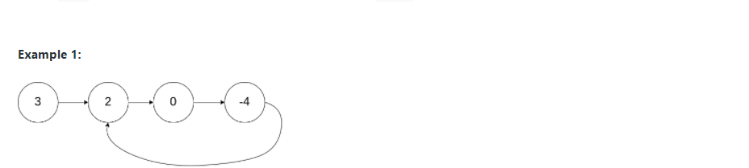

# LeetCode题解
<br>
<h2> 前言 <h2>

---
主要是为了准备算法面试，写下自己一些思考的过程.刷题的顺序是按照这位大佬给的目录刷 https://github.com/resumejob/Leetcode-retag

---

## 目录

### 链表篇

- [206.反转链表](#206-reverse-linked-list)

- [141.环形链表](#141环形链表)

## 206. Reverse Linked List

Given the head of a singly linked list, reverse the list, and return the reversed list.

For example :

Input: head = [1,2,3,4,5]

Output: [5,4,3,2,1]

Constraints:
- The number of nodes in the list is the range [0, 5000].
- -5000 <= Node.val <= 5000

题解：

```java
//Time Complexity O(n)
class Solution {
    public ListNode reverseList(ListNode head) {
       ListNode curr = head;
       ListNode prev = null;
        
        while (curr != null) {
            ListNode temp = curr.next;
            curr.next = prev;
            prev = curr;
            curr = temp;
        }
        
        return prev; 
    }
}
```
这道题并没有什么难点，初始化两个指针，每次改变一下curr指针的next指向，然后把curr指针和prev指针往下顺移就好了，直到curr指针为空值，prev指针就变成了[5,4,3,2,1]. 返回prev就好了。这道题我用的是迭代方法写的，官方还有递归的方法，感兴趣的可以去看看。

[**Back To Top**](#目录)

## 141.环形链表

Given head, the head of a linked list, determine if the linked list has a cycle in it.

There is a cycle in a linked list if there is some node in the list that can be reached again by continuously following the next pointer. Internally, pos is used to denote the index of the node that tail's next pointer is connected to. Note that pos is not passed as a parameter.

Return true if there is a cycle in the linked list. Otherwise, return false.

For example :



Input: head = [3,2,0,-4], pos = 1

Output: true

Explanation: There is a cycle in the linked list, where the tail connects to the 1st node (0-indexed).

Contraints:

- The number of the nodes in the list is in the range [0, 104].

- -105 <= Node.val <= 105

- pos is -1 or a valid index in the linked-list.

题解：


```java
//Time complexity O(n)
public class Solution {
    public boolean hasCycle(ListNode head) {
        if (head == null) {
            return false;
        }
        
        ListNode fast = head;
        ListNode slow = head;
        
        while (fast.next != null && fast.next.next != null) {
             fast = fast.next.next;
             slow = slow.next;
             if (fast == slow) {
                 return true;
             }
        }
        
        return false;
        
    }
}
```

[**Back To Top**](#目录)
