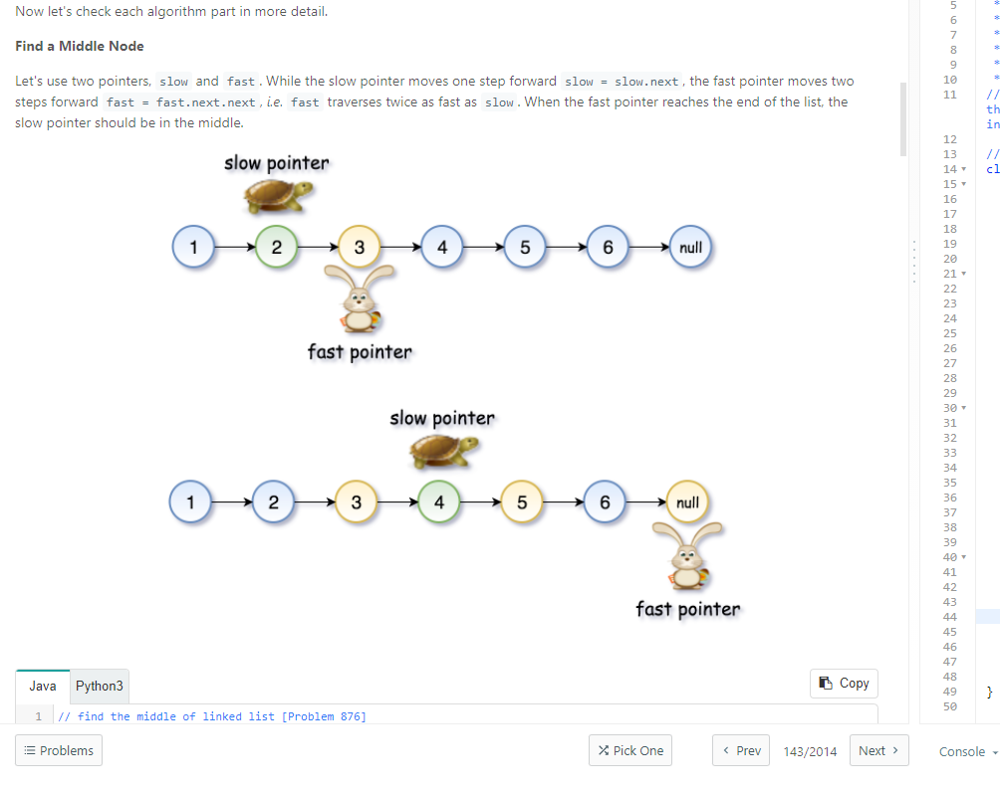

# LeetCode题解
<br>
<h2> 前言 <h2>

---
主要是为了准备算法面试，写下自己一些思考的过程.刷题的顺序是按照这位大佬给的目录刷 https://github.com/resumejob/Leetcode-retag

---

## 目录

### 链表篇

### 单链表

### 简单

- [206.反转链表](#206-reverse-linked-list)

- [141.环形链表](#141环形链表)

- [83.删除排序链表中的重复元素](#83删除排序链表中的重复元素)

- [234.回文链表](#234回文链表)

- [203.移除链表元素](#203移除链表元素)

- [237.删除链表中的节点](#237删除链表中的节点)

- [876.链表的中间结点](#876链表的中间结点)

- [143.重排链表](#143重排链表)

### 中等

 - [92.反转链表 II](#92反转链表-II)


 ### 双指针与滑动窗口

 ### 中等

 - [1493.Longest Subarray of 1 After Deleting One Elemen](#1493longest-subarray-of-1-after-deleting-one-element)


## 206. Reverse Linked List

Given the head of a singly linked list, reverse the list, and return the reversed list.

For example :

Input: head = [1,2,3,4,5]

Output: [5,4,3,2,1]

Constraints:
- The number of nodes in the list is the range [0, 5000].
- -5000 <= Node.val <= 5000

题解：

```java
//Time Complexity O(n)
class Solution {
    public ListNode reverseList(ListNode head) {
       ListNode curr = head;
       ListNode prev = null;
        
        while (curr != null) {
            ListNode temp = curr.next;
            curr.next = prev;
            prev = curr;
            curr = temp;
        }
        
        return prev; 
    }
}
```
这道题并没有什么难点，初始化两个指针，每次改变一下curr指针的next指向，然后把curr指针和prev指针往下顺移就好了，直到curr指针为空值，prev指针就变成了[5,4,3,2,1]. 返回prev就好了。这道题我用的是迭代方法写的，官方还有递归的方法，感兴趣的可以去看看。

[**Back To Top**](#目录)

## 141.环形链表

Given head, the head of a linked list, determine if the linked list has a cycle in it.

There is a cycle in a linked list if there is some node in the list that can be reached again by continuously following the next pointer. Internally, pos is used to denote the index of the node that tail's next pointer is connected to. Note that pos is not passed as a parameter.

Return true if there is a cycle in the linked list. Otherwise, return false.

For example :


Input: head = [3,2,0,-4], pos = 1

Output: true

Explanation: There is a cycle in the linked list, where the tail connects to the 1st node (0-indexed).

Contraints:

- The number of the nodes in the list is in the range [0, 104].

- -105 <= Node.val <= 105

- pos is -1 or a valid index in the linked-list.

题解：


```java
//Time complexity O(n)
public class Solution {
    public boolean hasCycle(ListNode head) {
        if (head == null) {
            return false;
        }
        
        ListNode fast = head;
        ListNode slow = head;
        
        while (fast.next != null && fast.next.next != null) {
             fast = fast.next.next;
             slow = slow.next;
             if (fast == slow) {
                 return true;
             }
        }
        
        return false;
        
    }
}
```

[**Back To Top**](#目录)

## 83.删除排序链表中的重复元素

Given the head of a sorted linked list, delete all duplicates such that each element appears only once. Return the linked list sorted as well.

For example : 

**Input: head = [1,1,2]**

**Output: [1,2]**

Constraints:

- The number of nodes in the list is in the range [0, 300].
- -100 <= Node.val <= 100
- The list is guaranteed to be sorted in ascending order.

题解：

```java
 // Time Complexity O(n), Space Complexity O(1)
class Solution {
    public ListNode deleteDuplicates(ListNode head) {
        if (head == null) {
            return null;
        }
        
        ListNode curr = head;
        
        while(curr != null && curr.next != null) {
            if (curr.val == curr.next.val) {
                curr.next = curr.next.next; 
            } else {
                curr = curr.next;
            }
            
        }
        return head;
    }
}
```

这里需要注意的是 curr = curr.next 前面需要加else，否则逻辑就不对了

[**Back To Top**](#目录)

## 234.回文链表

Given the head of a singly linked list, return true if it is a palindrome.

**Input: head = [1,2,2,1]**

**Output: true**

题解 ：

```java
//Time Complexity O(n), space Complexity O(1)
class Solution {
    public boolean isPalindrome(ListNode head) {
        if (head == null) return true;
        
        ListNode firstHalfEnd = endOfFirstHalf(head);
        ListNode secondHalfStart = reverseList(firstHalfEnd.next);
        //步骤3
        ListNode p1 = head;
        ListNode p2 = secondHalfStart;
        boolean result = true;
        while (result && p2 != null) {
            if (p1.val != p2.val) result = false;
            p1 = p1.next;
            p2 = p2.next;
        }
        //步骤4
        firstHalfEnd.next = reverseList(secondHalfStart);
        return result;
    }
    //步骤2
    private ListNode reverseList(ListNode head) {
        ListNode prev = null;
        ListNode curr = head;
        
        while (curr != null) {
            ListNode nextTemp = curr.next;
            curr.next = prev;
            prev = curr;
            curr = nextTemp;
        }
        return prev;
    }
    //步骤1
    private ListNode endOfFirstHalf(ListNode head) {
        ListNode fast = head;
        ListNode slow = head;
        
        while (fast.next != null && fast.next.next != null) {
            fast = fast.next.next;
            slow = slow.next;
        }
        return slow;
    }
}

```

这里因为用的迭代方法。空间是O(1)，并没有用额外的空间，所有题目变的难一些，可能用递归容易些吧，O(n)额外空间？
这道题大概有4个步骤：
1. 先找到中间的节点
2. reverse中间节点
3. 对比前半节点与后半节点
4. 再把之前reverse的后半节点再变回原样，从而使整个链表恢复开始原样，再输出结果值

[**Back To Top**](#目录)

## 203.移除链表元素

Given the head of a linked list and an integer val, remove all the nodes of the linked list that has Node.val == val, and return the new head.

For exmaple :

**Input: head = [1,2,6,3,4,5,6], val = 6**

**Output: [1,2,3,4,5]**

Constraints:

- The number of nodes in the list is in the range [0, 104].
- 1 <= Node.val <= 50
- 0 <= val <= 50

```java
/**
 * Definition for singly-linked list.
 * public class ListNode {
 *     int val;
 *     ListNode next;
 *     ListNode() {}
 *     ListNode(int val) { this.val = val; }
 *     ListNode(int val, ListNode next) { this.val = val; this.next = next; }
 * }
 */

//Time Complexity O(n), Space Complexity O(1)
class Solution {
    public ListNode removeElements(ListNode head, int val) {
        ListNode sentinel = new ListNode(0);
        sentinel.next = head;
        
        ListNode prev = sentinel, curr = head;
        while (curr != null) {
            if (curr.val == val) {
                 prev.next = curr.next;
            }else {
            prev = curr;
            }
             curr = curr.next;
        }
    
 
         return sentinel.next;
    }
}
```

题解： 我们这里首先需要一个sentinel node 在开头，是为了解决corner case 比如要delete first node. Now, the first node also becomes the middle node.

Step 1: Initialize a sentinel node, connect it to head node.

Step 2: Initialize prev pointer and curr pointer

Step 3: while curr is not null, if curr value equals val, then make prev.next to curr.next in order to remove target node, otherwise move prev pointer to curr pointer, curr pointer to curr next node

Step4 : return sentinel.next, which is head if it is not deleted. 

[**Back To Top**](#目录)

## 237.删除链表中的节点

Write a function to delete a node in a singly-linked list. You will not be given access to the head of the list, instead you will be given access to the node to be deleted directly.

It is guaranteed that the node to be deleted is not a tail node in the list.

**Input: head = [4,5,1,9], node = 5**

**Output: [4,1,9]**

**Explanation: You are given the second node with value 5, the linked list should become 4 -> 1 -> 9 after calling your function.**

```java
    class Solution {
    public void deleteNode(ListNode node) {
        node.val = node.next.val;
        node.next = node.next.next;
    }
}
```

Solution : 

Step1 : swap node with node next

Step2 : delete it

[**Back To Top**](#目录)

## 876.链表的中间结点

Given the head of a singly linked list, return the middle node of the linked list.

If there are two middle nodes, return the second middle node.

**Input: head = [1,2,3,4,5]**

**Output: [3,4,5]**

**Explanation: The middle node of the list is node 3.**

**Input: head = [1,2,3,4,5,6]**

**Output: [4,5,6]**

**Explanation: Since the list has two middle nodes with values 3 and 4, we return the second one.**

Constraints:

- The number of nodes in the list is in the range [1, 100].

- 1 <= Node.val <= 100

```java
/**
 * Definition for singly-linked list.
 * public class ListNode {
 *     int val;
 *     ListNode next;
 *     ListNode() {}
 *     ListNode(int val) { this.val = val; }
 *     ListNode(int val, ListNode next) { this.val = val; this.next = next; }
 * }
 */
// Time Complexity O(n), Space Complexity O(1)
class Solution {
    public ListNode middleNode(ListNode head) {
        ListNode fast = head;
        ListNode slow = head;
        
        while (fast != null && fast.next != null) {
            fast = fast.next.next;
            slow = slow.next;
        }
        
        return slow;
    }
}
```

Solution:

Normal problem. Just to remember this algorithm. 

[**Back To Top**](#目录)

## 92.反转链表 II

Given the head of a singly linked list and two integers left and right where left <= right, reverse the nodes of the list from position left to position right, and return the reversed list.

For example:

**Input: head = [1,2,3,4,5], left = 2, right = 4**

**Output: [1,4,3,2,5]**

Constraints:

- The number of nodes in the list is n.

- 1 <= n <= 500

- 500 <= Node.val <= 500

- 1 <= left <= right <= n

```java
/**
 * Definition for singly-linked list.
 * public class ListNode {
 *     int val;
 *     ListNode next;
 *     ListNode() {}
 *     ListNode(int val) { this.val = val; }
 *     ListNode(int val, ListNode next) { this.val = val; this.next = next; }
 * }
 */
//Time Complexity O(n), Space Complexity O(1)
class Solution {
    public ListNode reverseBetween(ListNode head, int m, int n) {
        if (head == null) {
            return null;
        }
        
        //find before reverse beginning node, which is the node before m---here is 1 and tail node(that after reverse)---here is 2
        ListNode curr = head, prev = null;
        while (m > 1) {
            prev = curr;
            curr = curr.next;
            m--;
            n--;
        }
        
        ListNode con = prev, tail = curr;
        
        //reverse the node between m to n
        ListNode third = null;
        while (n > 0) {
            third = curr.next;
            curr.next = prev;
            prev = curr;
            curr =third;
            n--;
        }
        //By using con node to connet the 4, which is 1->4 and tail node connects the 5, which is 2 -> 5. 
        if (con != null) {
            con.next = prev;
        }else {
            head = prev;
        }
        
        tail.next = curr;
        return head;
    }
}
```

Solution :


[**Back To Top**](#目录)


## 1493.Longest Subarray of 1 After Deleting One Element

Given a binary array nums, you should delete one element from it.

Return the size of the longest non-empty subarray containing only 1's in the resulting array.

Return 0 if there is no such subarray.

**Example 1:**

**Input: nums = [1,1,0,1]**

**Output: 3**

**Explanation: After deleting the number in position 2, [1,1,1] contains 3 numbers with value of 1's.**

**Example 2:**

**Input: nums = [0,1,1,1,0,1,1,0,1]**

**Output: 5**

**Explanation: After deleting the number in position 4, [0,1,1,1,1,1,0,1] longest subarray with value of 1's is [1,1,1,1,1].**

**Example 3:**

**Input: nums = [1,1,1]**

**Output: 2**

**Explanation: You must delete one element.**

**Example 4:**

**Input: nums = [1,1,0,0,1,1,1,0,1]**

**Output: 4**

**Example 5:**

**Input: nums = [0,0,0]**

**Output: 0**

**Constraints:**

**1 <= nums.length <= 10^5**

**nums[i] is either 0 or 1.**

```java
    class Solution {
    public int longestSubarray(int[] arr) {
      //Simple sliding window logic
        int k = 1;
        int n = arr.length;
        int i = 0;
        int j = 0;
        int max = Integer.MIN_VALUE;
        int count = 0; //count of 0's.
       while(j < n){
          
         if(arr[j] == 0){
            count++;
         }
         //if count of zero is greater than 1 simply slide your window
         if(count > k){
            while(count > k){
                if(arr[i] == 0) count--;
                i++;
            }
         }
         if(count == k) {
            max = Math.max(max,j - i);
         }
         j++;
       }
          //Edge cases 
          if(max == Integer.MIN_VALUE){
             /* 2 cases
             i.All values are 1 only 
             ii.All are zero only
             */
             return arr[0] == 1 ? n - 1 : 0;
          }
        
          return max;
    }
}
```

题解：这道题我们大体分成两组情况：第一种是全为0或者1的时候，返回值是0或者n-1。另一种情况是正常情况。

首先这道题让我们算删除一个0后，最长子区间1。那我们可以利用两个指针i与j把原区间缩小，去计算最长子区间。

计算[i,j]区间长度去代表最长子区间1，但是这里计算的时候，我们要保证区间[i,j]里面只能含一个0，这是因为我们只能删除一个0.如果随着J往后移的时候出现[i,j]有两个0，那么我们就要移动i,也就是把i移到j的位置,再继续扩大j的值，去计算下一个连续最长1子区间。这里K是用来表示区间[i,j]内最大0长度即1.拿Counter与K比较，计算去确保[i,j]区间内只有一个0.

举两个例子：[1,1,1,1,1,1,1,0,1] 计算就是 [1,1,1,1,1,1,1,0,1] 区间长度减去1. i = 0, j = 8; [1,1,1,1,1,1,1,0,0,1]计算的是两个子区间[1,1,1,1,1,1,1,0] 与 [0,1]

[**Back To Top**](#目录)

## 143.重排链表

You are given the head of a singly linked-list. The list can be represented as:

L0 → L1 → … → Ln - 1 → Ln
Reorder the list to be on the following form:

L0 → Ln → L1 → Ln - 1 → L2 → Ln - 2 → …
You may not modify the values in the list's nodes. Only nodes themselves may be changed.


**Constraints:**

- The number of nodes in the list is in the range [1, 5 * 104].

- 1 <= Node.val <= 1000

```java
/**
 * Definition for singly-linked list.
 * public class ListNode {
 *     int val;
 *     ListNode next;
 *     ListNode() {}
 *     ListNode(int val) { this.val = val; }
 *     ListNode(int val, ListNode next) { this.val = val; this.next = next; }
 * }
 */
//Time complexity: O(N). There are three steps here. To identify the middle node takes O(N) time. To reverse the second part of the list, one needs N/2 operations. The final step, to merge two lists, requires N/2 operations as well. In total, that results in O(N) time complexity.

//Space complexity:O(1), since we do not allocate any additional data structures.
class Solution {
  public void reorderList(ListNode head) {
    if (head == null) return;

    // find the middle of linked list [Problem 876]
    // in 1->2->3->4->5->6 find 4 
    ListNode slow = head, fast = head;
    while (fast != null && fast.next != null) {
      slow = slow.next;
      fast = fast.next.next;
    }

    // reverse the second part of the list [Problem 206]
    // convert 1->2->3->4->5->6 into 1->2->3->4 and 6->5->4
    // reverse the second half in-place
    ListNode prev = null, curr = slow;
    while (curr != null) {
      ListNode tmp = curr.next;
      curr.next = prev;
      prev = curr;
      curr = tmp;
    }

    // merge two sorted linked lists [Problem 21]
    // merge 1->2->3->4 and 6->5->4 into 1->6->2->5->3->4
    ListNode first = head, second = prev;
    while (second.next != null) {
      ListNode tmp = first.next;
      first.next = second;
      first = tmp;
      tmp = second.next;
      second.next = first;
      second = tmp;
    }
  }
}
```

Solution :




[**Back To Top**](#目录)